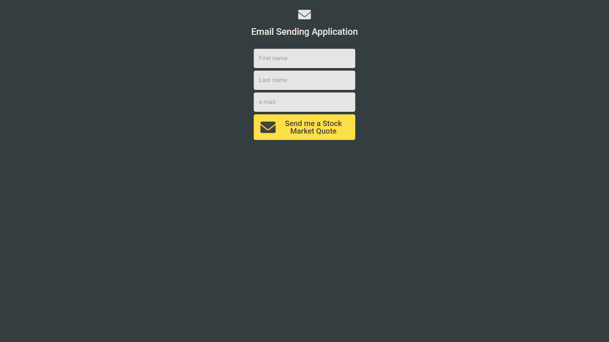

# FrontEnd Email sending application (Module #6, MERN Stack)


## Hosted Version of the Project:
[m6node-email-sending-application](https://m6node-email-sending-application.vercel.app/)

## Objectives
+ Created a Basic Form and Send Mail Using Nodemailer.
+ Learnt fundamentals of building a simple web form and using Nodemailer to send emails. 
+ Handling POST requests from the form
+ Parsing form data using body-parser or Express's built-in middleware.
+ Sending Emails with Nodemailer
+ Composing an email message from form data
+ Sending the email and handling success and error responses
+ Implementing basic form validation on the client side
+ Handling validation errors on the server side
+ Providing user feedback for successful and failed submissions


## How to install and run in yours local machine
```bash
npm install
npm run start
```

## Tech. Stack Used:
+ [React](https://react.dev/)
+ [TailwindCSS](https://tailwindcss.com/)
+ [Google Fonts](https://fonts.google.com/)
+ [Font Awesome](https://fontawesome.com/icons/)

## Author
[Abhishek kumar](https://www.linkedin.com/in/alex21c/), ([Geekster](https://geekster.in/) MERN Stack FS-14 Batch)


